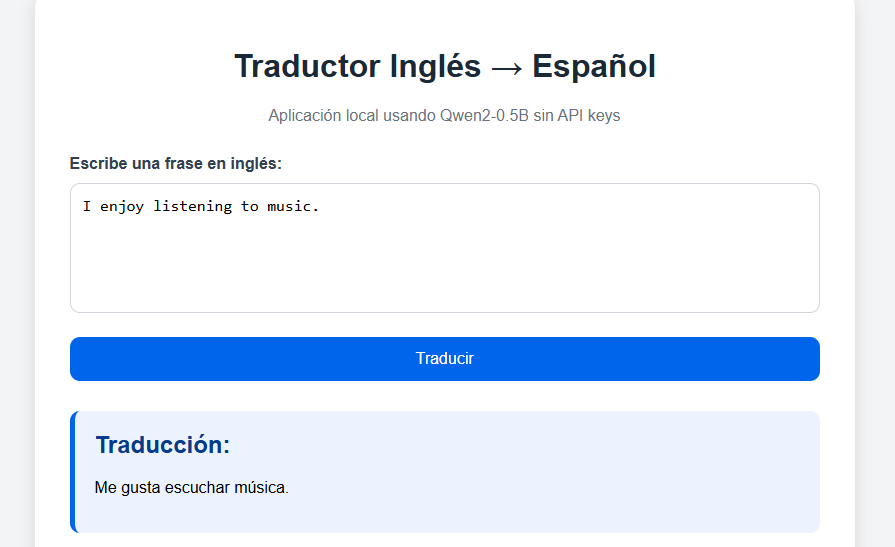

# Traductor con Qwen2-0.5B

Este proyecto es una pequeña aplicación web que traduce frases del inglés al español utilizando el modelo Qwen2-0.5B-Instruct.

No utiliza API keys de otros modelos. El modelo se carga localmente usando la librería Transformers de Hugging Face.

## Ejemplos mínimos

La aplicación debe funcionar con estos ejemplos:

- I like soccer
- How are you?
- What time is it?

## Estructura del proyecto

```text
traductor-qwen/
│
├── app.py
├── requirements.txt
├── README.md
└── templates/
    └── index.html

## Vista de la aplicación


